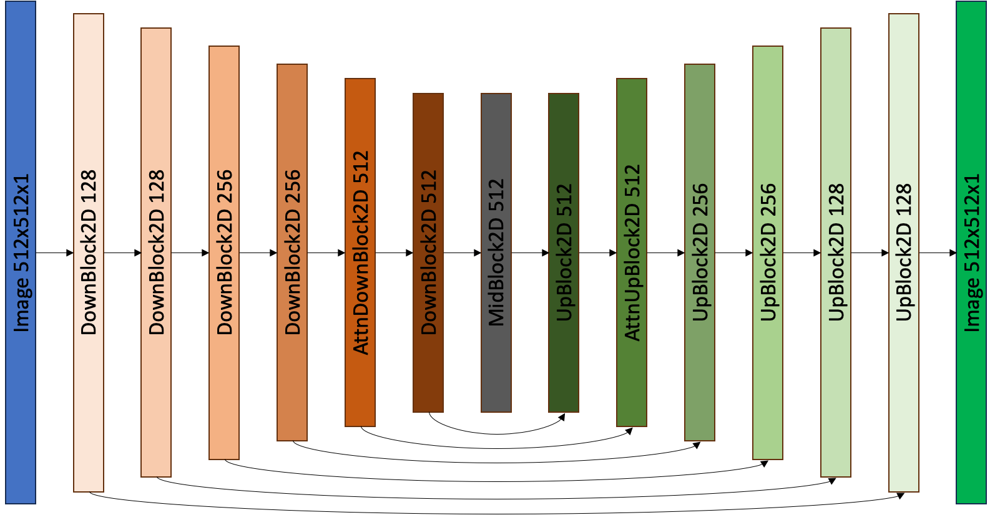

# Thin Film Diffusion Model

# Diffusion Model이란?

- 이미지를 만들어내는 뉴럴 네트워크의 한 종류
- GAN의 경우 noise에서 이미지를 1 step으로 만들어내는데, diffusion model의 경우 n-step의 denoising process를 거쳐 이미지를 생성함

## 기본 원리

### 학습 과정

- 깨끗한 이미지가 완벽한 noise로 변화는 과정을 N개로 구분했다고 가정
    - Timestep T에 대해 Image(T=0) → 깨끗한 이미지, Image(T=N) → 완벽한 noise
- 임의의 시간 t에 대해 깨끗한 이미지가 있을 때 Image(T=t)는 쉽게 만들 수 있음
    - Image(T=t) = Image(T=0) * (1 - t / N) + Image(T=N) * t / N
- 역으로 Image(T=t)가 주어졌을 때
    - Image(T=0)을 만들 수 있을까? → predicting I0
        - Noise가 아닌 이미지 컨텐츠를 예측해야돼서 학습 효율이 떨어짐
    - Image(T=t) = Image(T=0) + x로 정의했을 때 x를 추론할 수 있을까? → predicting noise
        - 이 때 Image(T=0)은 Image(T=t) - x_estimated로 구할 수 있음
        - 이미지 컨텐츠에 상관없는 Gaussian noise를 예측하면 되므로 학습 효율이 좋음
- UNet에 timestep을 encoding한 Image(T=t)를 입력으로 주고 noise 또는 Image(T=0)을 output으로 내게 해서 ground truth와 비교

### 추론 과정

- 완벽한 noise로부터 denoising step 가동 (Image(T=0) 혹은 noise를 예측하지만 설명 편의상 Image(T=0)이 output으로 나온다고 가정)
- Step 0: Image(T=N) → UNet → Image(T=0)
    - Image(T=0)에 N-1의 noise를 끼얹어서 Image(T=N-1) 획득
- Step 1: Image(T=N-1) → UNet → Image(T=0)
    - Image(T=0)에 N-2의 noise를 끼얹어서 Image(T=N-2) 획득
- 반복
- Step N-1: Image(T=1) → UNet → Image(T=0)
    - 끝

## 장단점

- GAN에 비해 더 다양하고 높은 퀄리티의 이미지를 생성할 수 있음
- Text, Vector, Image등 다양한 condition을 쉽게 걸 수 있음
- Denoising step을 중간부터 진행해서 유사한 이미지를 많이 뽑을 수 있음
    - 예) 피카츄 이미지에 50% noise 적용 후 T=0까지 denoising
- GAN에 비해 추론 시간이 오래 걸림 → DDIM의 도입으로 확연히 단축됨 (A100기준 512x512 < 1 sec)

# 네트워크 구조

## UNet

- 각 Block별로 ResNet Block이 2개씩 들어가있음
- 각 ResNet Block별로 time + condition embedding이 투입되어 정보를 전달함

## 데이터

- CSV (filepath, x1, x2, x3, …, x8)
- filepath로부터 이미지를 읽어서 ROI 부분 crop후 512x512로 resizing
    - ROI (top, left, height, width): 678, 0, 767, 2452
- x1, …, x8은 (v - mean) / stdev로 normalize
    - 이전 framework에서 초반에 자꾸 터져서 normalize했더니 생명이 연장되었음
    - framework 바꾼 후 원상복구 안 하고 그대로 사용
    

# 코드

- 레퍼런스
    - [https://huggingface.co/docs/diffusers/tutorials/basic_training](https://huggingface.co/docs/diffusers/tutorials/basic_training)
    - [https://huggingface.co/blog/annotated-diffusion](https://huggingface.co/blog/annotated-diffusion)
    - [https://github.com/huggingface/diffusers/tree/main/examples/unconditional_image_generation](https://github.com/huggingface/diffusers/tree/main/examples/unconditional_image_generation)
- Repository
    - https://github.com/dalbom/thin-film-diffusion
    

## Todo

- normalization 없이 돌려보기
- 리얼 이미지로 regression model 돌려보기